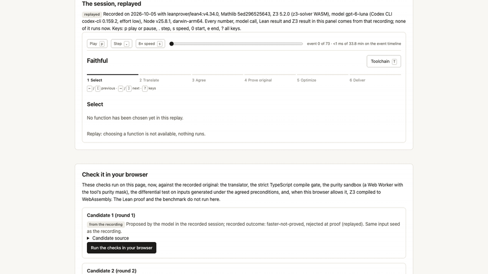

# Faithful

Faithful takes one TypeScript function and makes it faster without changing what it does. A fixed translator (no model
involved) turns the function into a Lean 4 model. You and a model agree on a spec in plain words, after a challenge run
that looks for inputs where spec and code disagree. Lean then checks a proof that the original meets that spec. A model
proposes faster rewrites, and each one must pass a compile check, a purity check, a differential test against the
original, a bounded Z3 check where available, a benchmark with confidence intervals, and a Lean proof against the same
spec. Only then is it delivered at the strongest label its evidence supports. The point of the tool is in one line:
provably the same, measurably faster, and the tool never rounds up a claim.

## What a result says: the five labels

Every claim carries exactly one label, strongest first (`TIER_LABEL` in `packages/core/src/tiers.ts`):

| label | meaning |
|---|---|
| **Proved** | Lean 4 accepted a theorem that Faithful wrote, relating the Lean model of the function to the agreed spec, using only the standard axioms. |
| **Proved (trusting the compiler)** | As Proved, except that the proof uses `native_decide`, so Lean's compiler and runtime are in the trusted base. |
| **Verified to k** (shown as e.g. `Verified to k=6`) | Z3 found no input within the stated bounds where the candidate differs from the original. |
| **Tested** | The candidate passed compile, purity and the differential test on the generated inputs, and nothing stronger. |
| **Not proved** | No accepted proof exists. A failed proof is a failed proof: it shows neither that the function nor that the spec is wrong. |

Wherever "Proved" appears, this sentence appears with it (N is the number of inputs on which the model was checked
against the TypeScript):

> Proved for the Lean model of this function. The model is produced by a fixed translator (docs/TRANSLATOR.md) and checked against the TypeScript on N inputs.

What is proved, and what is not: the theorem is about the **Lean model** and the **agreed spec**, under stated
preconditions (integers within ±2^53, BMP strings, in-range indices, carve-outs you accepted). It is not a theorem
about the TypeScript itself, and Faithful never says a TypeScript function was proved on every input. Each label's
meaning, what it does not mean, and how it could be wrong: [docs/TIERS.md](docs/TIERS.md).

Speedups are printed with their 95% CI and the declared input distribution. Estimates and lower bounds are rounded
down and upper bounds up, and "faster" is said only when the interval, as printed, lies above 1. Faithful prints no
scores, grades or percentages.

## Install

Requires Node 22.12 or later, pnpm, the Codex CLI (for model calls), and about 7 GB of disk for the Lean/Mathlib cache.

```
pnpm install
pnpm build
node packages/cli/dist/bin.js doctor     # checks Node, Codex, Lean, Mathlib cache, Z3, disk
node packages/cli/dist/bin.js setup      # installs and caches the Lean toolchain; states the cost first
```

`faithful` below means `node packages/cli/dist/bin.js` (or `pnpm faithful <command>` from the repository root).
`faithful setup` states its cost before it starts: the pinned Lean toolchain (about 0.4 GB) and the Mathlib build cache
(about 2 GB to download, about 7 GB on disk), about 1 to 15 minutes depending on your connection. Lean is installed under
`~/.elan` only with `--install-elan`.

## Usage

```
faithful                                  # open the browser UI for the repository in the current directory
faithful optimize <file> --fn <name>      # run the workflow headlessly
faithful optimize <file> --fn <name> --tested   # if the translator refuses the function, continue on the Tested tier only
faithful verify .faithful/<fn>            # re-check a delivered result without trusting it
faithful showcase-record <file> --fn <name>     # record a full session for the static showcase
```

Environment: `FAITHFUL_MODEL` (default `gpt-6-luna`), `FAITHFUL_EFFORT`, `FAITHFUL_LEAN_DIR`.

## The workflow in six steps

1. **Select** a function in your repository.
2. **Translate** it into a Lean 4 model with the fixed translator, or see exactly why it is refused.
3. **Agree** on a spec: the model proposes one in plain words and Lean; a challenge run looks for inputs where spec and
   code disagree; you rule on each disagreement (fix the spec, carve the inputs out, or treat a throw as a precondition).
4. **Prove the original** meets the agreed spec (default budget: at most 10 attempts and 12 minutes; Lean checks every
   attempt).
5. **Optimize**: the model proposes faster rewrites; each goes through compile, purity, differential test, bounded Z3
   check (when available), benchmark, and a Lean proof for a candidate that is significantly faster than the current
   best.
6. **Deliver** a patch, a provenance file and `VERIFY.md`. Your source files are never modified; `faithful verify`
   re-checks the delivery.

## The translator subset

The translator accepts subset v1 of TypeScript: integer arithmetic (as `Int` with a ±2^53 range check), booleans,
BMP strings, arrays, tuples, records and options, loops and recursion with a termination measure it can find, and a
fixed library of builtins. It refuses floats, bitwise operators, regular expressions, `Map`/`Set`, dates, randomness,
I/O, `async`, `this`, generics, overloads and more, each with a refusal code and a line number. On the 74-function
corpus, 39 are in the subset; on a sample of 20 functions from real libraries, 0 are. Refused functions can still be
optimized on the Tested tier only. Full description: [docs/TRANSLATOR.md](docs/TRANSLATOR.md).

## Showcase

A static site opens on a landing page, then replays recorded sessions and re-runs the funnel (translate, compile,
purity, differential, Z3) live in the browser. The default recording is `clamp`: a rewrite that passed 1000
differential inputs is rejected because Z3 found the input [-2,-1,-3], on which the original throws and the rewrite
returns -1. The local UI shows the same landing page as its start screen when you tick "Show this page when Faithful
opens" (kept in a session cookie).

showcase: build with `pnpm --filter @faithful/showcase build`

**Z3 in the browser.** `z3-solver` 5.2.0 needs `SharedArrayBuffer`, so it works only with cross-origin isolation. The
showcase gets it on static hosting from the vendored coi-serviceworker 0.1.7, which reloads the page once on the first
visit. Without isolation the SMT stage shows "not available here". Tested in headless Chrome 154 only; Firefox and
Safari are untested.

## Media

The demo media is produced by `node scripts/make-media.mjs <recording>` from a real recorded session under
`apps/showcase/public/recordings/` (the script refuses fixtures and the development sample). If the files below are
missing, they have not been generated yet. The current files come from `apps/showcase/public/recordings/clamp.json`.



Video (MP4, 1280x720): [docs/media/faithful-demo.mp4](docs/media/faithful-demo.mp4)

## Packages

```
packages/core        tier vocabulary and the Proved sentence, toolchain stamp, subprocess runner, .faithful store
packages/translate   TypeScript subset v1 -> Lean 4 model (deterministic; no model call)
packages/engine      sandbox, differential and mutation testers, benchmark, evidence line
packages/smt         IR -> SMT-LIB, Z3 drivers, "Verified to k"
packages/prover      Lean project, proof checking, axiom policy, Codex driver, spec and proof generation
packages/session     event-sourced session state
packages/cli         faithful commands, local server, autopilot for measurements
apps/ui              browser UI served by the CLI
apps/showcase        static replay site
lean/                Lake project: pinned Lean 4.34.0 + Mathlib, Faithful runtime library
```

## Documentation

* [docs/DESIGN.md](docs/DESIGN.md): the design contract, non-negotiables, deviations
* [docs/TIERS.md](docs/TIERS.md): what each label means and does not mean
* [docs/TRANSLATOR.md](docs/TRANSLATOR.md): the subset, the translation, refusal codes, gaps, red-team history
* [docs/SMT.md](docs/SMT.md): the bounded SMT tier
* [docs/PROOFS.md](docs/PROOFS.md): proof generation, checking, tuning and held-out results
* [docs/BENCH.md](docs/BENCH.md): benchmark method and limits
* [docs/SECURITY.md](docs/SECURITY.md): what is isolated, what leaves the machine, what is not protected
* [docs/LAUNCH.md](docs/LAUNCH.md): launch report with the measured tables

## License and attribution

MIT ([LICENSE](LICENSE)). Code adapted from other projects, the library sample's sources and the vendored service
worker are listed in [NOTICE.md](NOTICE.md).
